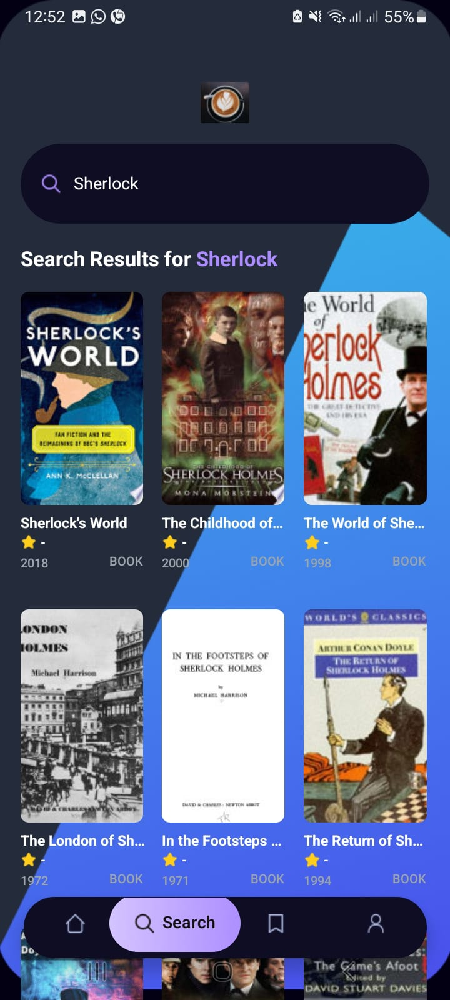
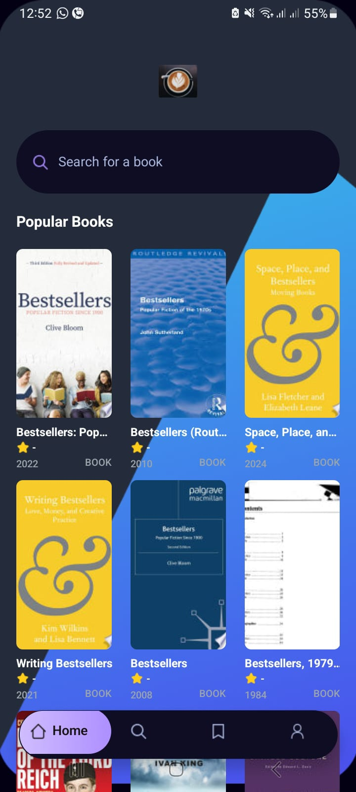

# Book Recommender & Explorer (React Native + Expo)

A mobile app to explore and search books using the Google Books API. Converted from a movies demo to a books experience, with a clean UI, search, list, and details views.

## Features
- Search books by title/keyword
- Browse popular books (bestsellers query)
- Book details: cover, authors, categories, rating, pages, publisher, language, description
- Responsive UI with tabs and detail navigation

## Tech Stack
- React Native (Expo)
- Expo Router
- Tailwind (via `nativewind`)
- Google Books API

## Screenshots






## Getting Started

### Prerequisites
- Node.js 18+
- npm or yarn
- Expo CLI (optional)

### Install & Run
```bash
cd /home/mukullight/Videos/bookapp
npm install
npx expo start
```
- Press `a` for Android, `i` for iOS (on macOS), or `w` for web.
- If you face cache issues, start with clear cache:
```bash
npx expo start -c
```

## Configuration
- The app uses Google Books API which does not require an API key for basic search/detail.
- If you want to customize the initial list, edit `fetchBooks` in `services/api.ts` (default query: "bestsellers").

## Project Structure (key parts)
- `app/(tabs)/index.tsx`: Home (popular books)
- `app/(tabs)/search.tsx`: Search books
- `app/book/[id].tsx`: Book details screen
- `components/MovieCard.tsx`: Book card (renamed usage but kept filename)
- `services/api.ts`: Google Books fetchers
- `interfaces/interfaces.d.ts`: `Book` and `BookDetails` types

## Notes
- Some filenames retain "movie" for brevity, but logic and UI reflect books.
- SafeAreaView is via `react-native-safe-area-context`.

## License
MIT


